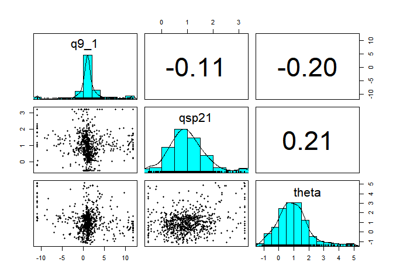

<!-- README.md is generated from README.Rmd. Please edit that file -->

# pvcalibrater

<!-- badges: start -->

badge_codecov(ghaccount=“Phalacrocorax-gaimardi”,ghrepo=“pvcalibrater”,branch=“master”)
<!-- badges: end -->

pvcalibrater calibrates agent-based-model for solar photo-voltaic
adoption by Irish households.

Each agent has a utility function for pv adoption consisting of
individually weighted financial, social and barrier partial
(dis-)utility terms.

## Installation

You can install pvcalibrater from [GitHub](https://github.com/) with:

``` r
# install.packages("devtools")
devtools::install_github("Phalacrocorax-gaimardi/pvcalibrater")
```

## Data

Survey data consists 28 features for 1208 agents.

| code | question                                                           | answercode | answer                                                         |
|:-----|:-------------------------------------------------------------------|-----------:|:---------------------------------------------------------------|
| q1   | Which of the following best describes the property where you live? |          2 | Terraced house                                                 |
| q1   | Which of the following best describes the property where you live? |          3 | Semi-detached house                                            |
| q1   | Which of the following best describes the property where you live? |          4 | Detached house                                                 |
| q1   | Which of the following best describes the property where you live? |          5 | Other                                                          |
| q3   | Which of the following best describes your living situation?       |          1 | I live in a property that myself or family own outright        |
| q3   | Which of the following best describes your living situation?       |          2 | I live in a property that myself or family own with a mortgage |
| q3   | Which of the following best describes your living situation?       |          3 | I live in a property that myself or family are renting         |
| q3   | Which of the following best describes your living situation?       |         98 | Other (Please specify)                                         |

A survey of pv_qanda describing the survey questions and choice of
answers

|  ID | age | gender | class | region | qc1 |  q1 |  q3 |  q5 |  q7 | q9_1 | q10b | q15 | q16 | q17b | q17c | q17a_1 | q17a_2 | q17a_3 | q17a_5 | qsp20 | qsp21 |  qj |  qk |  qh |  qg |  qf | qsp22_7 |
|----:|----:|-------:|------:|-------:|----:|----:|----:|----:|----:|-----:|-----:|----:|----:|-----:|-----:|-------:|-------:|-------:|-------:|------:|------:|----:|----:|----:|----:|----:|--------:|
|  10 |   3 |      2 |     2 |      4 |   2 |   3 |   3 |   4 |   2 |   NA |    4 |   6 |   1 |    3 |    3 |      3 |      3 |      3 |      3 |     3 |     1 |   2 |   4 |  10 |   1 |   3 |       3 |
|  11 |   5 |      2 |     1 |      4 |   1 |   4 |   1 |   3 |   2 |    3 |    3 |   3 |   6 |    4 |    3 |      1 |      4 |      4 |      4 |     5 |     2 |   2 |   4 |   3 |   1 |   5 |       1 |
|  12 |   1 |      2 |     1 |      1 |   2 |   3 |   1 |   2 |   1 |   NA |    1 |   2 |   4 |    4 |    2 |      1 |      1 |      1 |      1 |     3 |     1 |   4 |   1 |   1 |   2 |   3 |       2 |
|  13 |   4 |      2 |     2 |      3 |   1 |   3 |   2 |   4 |   1 |    5 |    2 |   3 |   6 |    3 |    3 |      4 |      4 |      4 |      4 |     3 |     2 |   2 |   5 |   5 |   1 |   1 |       4 |
|  14 |   5 |      2 |     2 |      1 |   2 |   3 |   1 |   3 |   2 |    4 |    2 |   2 |   6 |    2 |    4 |      2 |      4 |      4 |      5 |     3 |     1 |   2 |   3 |   4 |   1 |   1 |       4 |

A sample of pv_data which contains the survey responses

## Model

A boosted tree regression model predicts the utility for pv adoption
from the discrete values taken by 27 agent features.

``` r
##xgboost
bst <- get_boosted_tree_model(pv_data_oo,complexity_factor = 1.5)
##partial utility contribution for each feature and agent
shap_scores_long_sample <- get_shap_scores(pv_data_oo,bst)
##average utilities for features used in ABM (financial q9_1, social qsp21 and barrier)
get_empirical_partial_utilities(shap_scores_long)
##individual weights for financial, social and barrier terms
abm_weights <- get_model_weights(shap_scores_long)
```

## Plot

    #> Joining, by = c("code", "answercode")


