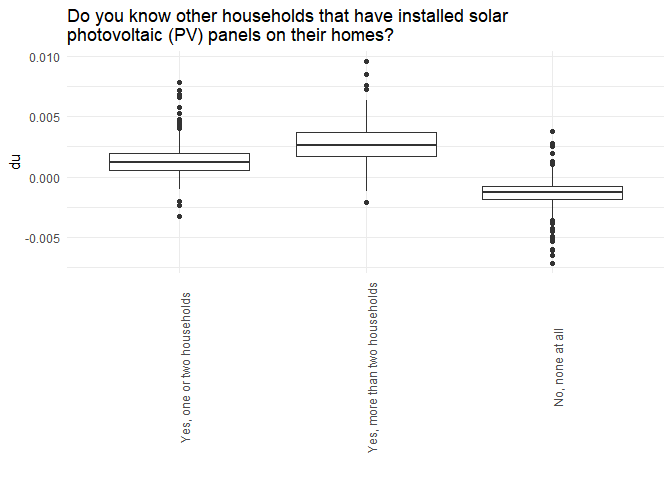
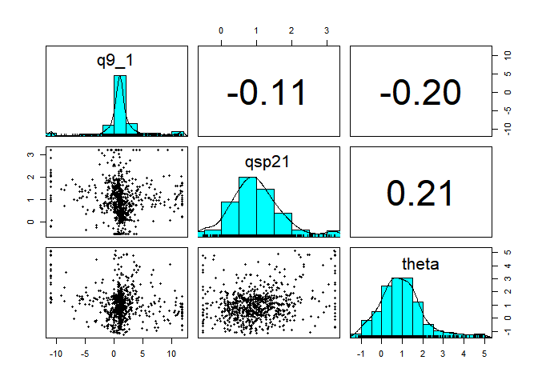

<!-- README.md is generated from README.Rmd. Please edit that file -->

# pvcalibrater

<!-- badges: start -->

[](commits/master)
[](/commits/master)
<!-- badges: end -->

pvcalibrater calibrates agent-based-model for solar photo-voltaic
adoption by Irish households.

## Installation

You can install pvcalibrater from [GitHub](https://github.com/) with:

``` r
# install.packages("devtools")
devtools::install_github("Phalacrocorax-gaimardi/pvcalibrater")
```

## Data

The PV survey dataset **pv_data** has 27 discrete features of 1208
agents. The survey questions and the corresponding answer choices are
described in **pv_qanda**. Samples from **pv_qanda** and **pv_data** are
given below.

| code | question                                                           | answercode | answer                                                         |
|:-----|:-------------------------------------------------------------------|-----------:|:---------------------------------------------------------------|
| q1   | Which of the following best describes the property where you live? |          2 | Terraced house                                                 |
| q1   | Which of the following best describes the property where you live? |          3 | Semi-detached house                                            |
| q1   | Which of the following best describes the property where you live? |          4 | Detached house                                                 |
| q1   | Which of the following best describes the property where you live? |          5 | Other                                                          |
| q3   | Which of the following best describes your living situation?       |          1 | I live in a property that myself or family own outright        |
| q3   | Which of the following best describes your living situation?       |          2 | I live in a property that myself or family own with a mortgage |
| q3   | Which of the following best describes your living situation?       |          3 | I live in a property that myself or family are renting         |
| q3   | Which of the following best describes your living situation?       |         98 | Other (Please specify)                                         |

| age | gender | class | region | qc1 |  q1 |  q3 |  q5 |  q7 | q9_1 | q10b | q15 | q16 | q17b | q17c | q17a_1 | q17a_2 | q17a_3 | q17a_5 | qsp20 | qsp21 |  qj |  qk |  qh |  qg |  qf | qsp22_7 |
|----:|-------:|------:|-------:|----:|----:|----:|----:|----:|-----:|-----:|----:|----:|-----:|-----:|-------:|-------:|-------:|-------:|------:|------:|----:|----:|----:|----:|----:|--------:|
|   3 |      2 |     2 |      4 |   2 |   3 |   3 |   4 |   2 |   NA |    4 |   6 |   1 |    3 |    3 |      3 |      3 |      3 |      3 |     3 |     1 |   2 |   4 |  10 |   1 |   3 |       3 |
|   5 |      2 |     1 |      4 |   1 |   4 |   1 |   3 |   2 |    2 |    3 |   3 |   6 |    4 |    3 |      1 |      4 |      4 |      4 |     5 |     2 |   2 |   4 |   3 |   1 |   5 |       1 |
|   1 |      2 |     1 |      1 |   2 |   3 |   1 |   2 |   1 |   NA |    1 |   2 |   4 |    4 |    2 |      1 |      1 |      1 |      1 |     3 |     1 |   4 |   1 |   1 |   2 |   3 |       2 |
|   4 |      2 |     2 |      3 |   1 |   3 |   2 |   4 |   1 |    3 |    2 |   3 |   6 |    3 |    3 |      4 |      4 |      4 |      4 |     3 |     2 |   2 |   5 |   5 |   1 |   1 |       4 |
|   5 |      2 |     2 |      1 |   2 |   3 |   1 |   3 |   2 |    3 |    2 |   2 |   6 |    2 |    4 |      2 |      4 |      4 |      5 |     3 |     1 |   2 |   3 |   4 |   1 |   1 |       4 |

Subsets of the full survey can be used to train alternative models. For
example, *pv_data_oo* excludes non owner-occupiers and apartments

``` r
pv_data_oo <- pv_data %>% dplyr::filter(q1 %in% 2:4,q3 %in% 1:2)
```

## Model

Firstly, **pv_calibrater** converts stated adoption likelihood (Likert
scores **qsp22_7**) to adoption utilities, using simple assumptions for
utility uncertainty and hypothetical bias. Hypothetical bias is
fined-tuned later in the ABM by matching the observed PV adoption.
Secondly, **pv_calibrater** generates an additive boosted tree
regression model trained on the utilities. The model predicts an agent’s
expected adoption utility as a function of the discrete values taken by
26 agent features.

``` r
##xgboost
bst <- get_boosted_tree_model(pv_data_oo,complexity_factor = 1.5)
```

All features contribute to the model adoption utility of an agent. These
contributions are identified as Shapley importance scores.

``` r
##partial utility contribution for each feature and agent
shap_scores_long_sample <- get_shap_scores(pv_data_oo,bst)
```

An ABM abstracts out some features that vary over the simulation time.
–pv_calibrater\_\_ assumes these are financial and social. Averaging
over all agents gives the empirical financial and social partial utility
functions. The remaiing features have an average value $\theta$ (barrier
term)

``` r
##mean partial utility functions for features used in ABM (financial q9_1, social qsp21 and barrier)
get_empirical_partial_utilities(shap_scores_long_sample)
#> Joining, by = c("code", "answercode")
#> # A tibble: 8 x 3
#> # Groups:   code [3]
#>   code  answercode   du_mean
#>   <chr>      <dbl>     <dbl>
#> 1 q9_1           1  0.000316
#> 2 q9_1           2 -0.00101 
#> 3 q9_1           3  0.00781 
#> 4 q9_1          NA -0.00383 
#> 5 qsp21          1 -0.00139 
#> 6 qsp21          2  0.00137 
#> 7 qsp21          3  0.00284 
#> 8 theta         NA -0.0405
```

An individual agents adoption utility is a sum of the mean partial
utilities with weights:

``` r
##individual weights for financial, social and barrier terms
get_model_weights(shap_scores_long_sample)
#> Joining, by = c("code", "answercode")
#> # A tibble: 755 x 4
#>       ID    q9_1    qsp21 theta
#>    <int>   <dbl>    <dbl> <dbl>
#>  1     1   3.32   0.576   2.83 
#>  2     2   0.829 -0.00886 2.04 
#>  3     3  -0.114  1.50    2.88 
#>  4     4   0.301  3.22    5.12 
#>  5     5 -27.6    4.33    5.06 
#>  6     6   0.199 -1.46    4.76 
#>  7     7   0.825  3.74    2.67 
#>  8     8   1.57   0.309   0.654
#>  9     9   1.44  -0.532   0.663
#> 10    10 -13.9    1.83    1.54 
#> # ... with 745 more rows
```

## Plots

The social influence contribution to adoption utility

``` r
plot_feature_utility(shap_scores_long_sample, "qsp21")
```



A pairs plot showing the distribution of weights is created by
plot_weights

``` r
plot_weights(shap_scores_long_sample)
#> Joining, by = c("code", "answercode")
```


